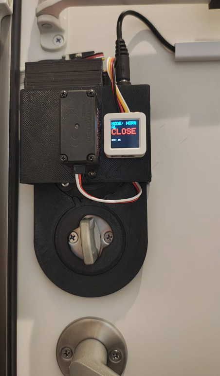

# My Smartlock


# 機能
- Wifi・NFCモジュールの接続遮断時の自動再起動機能
- AWS IoT CoreのトピックをListenして解錠・施錠（AWS Lambda経由でトピックへのPublishが可能）
- ローカルのUDPブロードキャストパケットをListenして解錠・施錠
- 登録済みのNFCカードを読み取った時に解錠
- 「自動ドア開閉待機モード」の時にドアの開閉を検知すると、自動で施錠
  * これはM5Atomのボタンを押したときや、コマンド経由で解錠されたときのみ有効になる
  * 外出する時はボタンを押して出れば自動で施錠されるし、帰宅時に解錠コマンドで解錠したあと、ドアが閉まると施錠される
  * 一瞬外に出るだけの時は自動施錠してほしくないので、外出の時はボタンを押す操作を求めるようにしている。

# PN532モジュールのPlatformIOプロジェクトへの追加

階層に分かれているとPlatformIOで見つけられないので、以下で暫定処置。  　
`library.json`を正しく記述すれば以下の処置は必要ないと思われる。

```
cd m5atom_prj
mkdir lib && cd lib
git clone git@github.com:elechouse/PN532.git && cd PN532
mv PN532/* ./
mv PN532_I2C/* ./
```

